## Main goals

1. How do we produce a model?
2. How do we convey that it works?
3. How do we talk about how it makes predictions?

## But why...

... think of SDM as ML problems?
: Because they are! We want to learn a predictive algorithm from data

... the focus on explainability?
: We cannot ask people to *trust* - we must *convince* and *explain*

## What we will *not* discuss

1. Image recognition
2. Sound recognition
3. Generative AI

## Learning/teaching goals

- ML basics
    - cross-validation
    - hyper-parameters tuning
    - bagging and ensembles
- Pitfalls
    - data leakage
    - overfitting
- Explainable ML
    - partial responses
    - Shapley values

## But wait!

- a similar example fully worked out usually takes me 21 hours of class time
- this is an overview
- don't care about the output, care about the \alert{process}!

# Problem statement

## The problem in ecological terms

We have information about a species, taking the form of $(\text{lon}, \text{lat})$ for
points where the species was observed

Using this information, we can extract a suite of environmental variables for the locations
where the species was observed

We can do the same thing for locations where the species was not observed

\alert{Where could we observe this species}?

## The problem in ML terms

We have a series of labels $\mathbf{y}_n \in \mathbb{B}$, and features
$\mathbf{X}_{m,n} \in \mathbb{R}$

We want to find an algorithm $f(\mathbf{x}_m) = \hat y$ that results in the
distance between $\hat y$ and $y$ being *small*

An algorithm that does this job well is generalizable (we can apply it on data it has not
been trained on) and makes credible predictions

## Setting up the data for our example

We will use data on observations of *Turdus torquatus* in Switzerland,
downloaded from the copy of the eBird dataset on GBIF

Two series of environmental layers

1. CHELSA2 BioClim variables (19)
2. EarthEnv land cover variables (12)

Now is *not* the time to make assumptions about which are relevant!

## The observation data

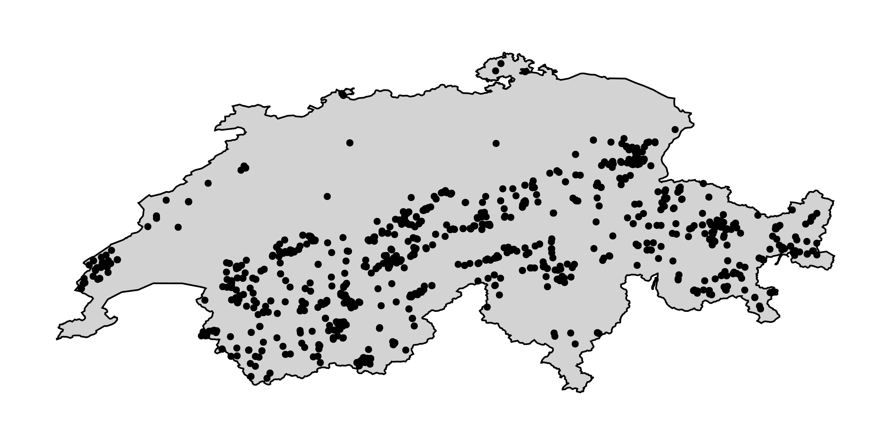\ 

## Problem (and solution)

We want $\textbf{y} \in \mathbb{B}$, and so far we are missing \alert{negative
values}

We generate \alert{pseudo}-absences with the following rules:

1. Locations further away from a presence are more likely
2. Locations less than 6km away from a presence are ruled out
3. Pseudo-absences are twice as common as presences

## The (inflated) observation data

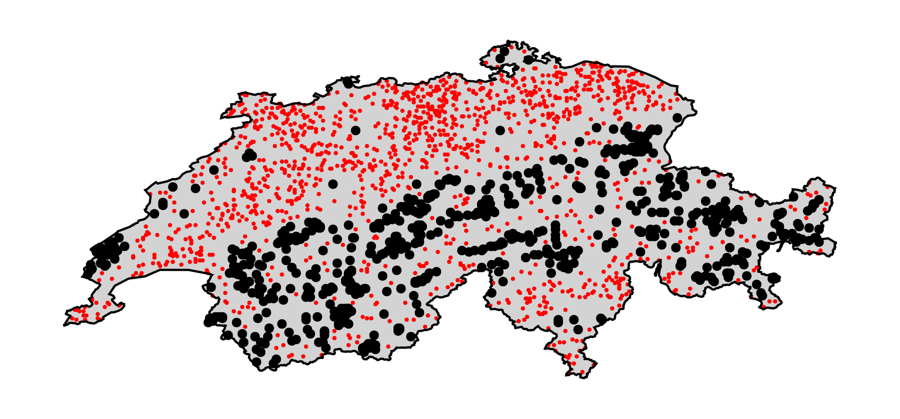\ 

# Training the model

## A simple decision tree

Decision trees *recursively* split observations by picking the best variable and value.

Given enough depth, they can \alert{overfit} the training data (we'll get back to this).

## Setup

We need an \alert{initial} model to get started: what if we use *all the variables*?

We shouldn't use all the variables.

**But**! It is a good baseline. A good baseline is important.

## Cross-validation

Can we train the model?

More specifically -- if we train the model, how well can we expect it to perform?

The way we answer this question is: in many parallel universes with slightly
less data, is the model good?

## Null classifiers

What if the model guessed based on chance only?

What is \alert{chance only}?

50%, based on prevalence, or always the same answer

## Expectations

The null classifiers tell us what we need to beat in order to perform \alert{better than
chance}.

| **Model** | **MCC** | **PPV** | **NPV** | **DOR** | **Accuracy** |
|----------:|--------:|--------:|--------:|--------:|-------------:|
| No skill  | -0.00   |  0.34   |  0.66   |  1.00   |  0.55        |
| Coin flip | -0.32   |  0.34   |  0.34   |  0.26   |  0.34        |
| +         |  0.00   |  0.34   |         |         |  0.34        |
| -         |  0.00   |         |  0.66   |         |  0.66        |

In practice, the no-skill classifier is the most informative: what if we \alert{only} know
the positive class prevalence?

## Cross-validation strategy

- k-fold cross-validation
- no testing data here

## Cross-validation results

| **Model**        | **MCC** | **PPV** | **NPV** | **DOR** | **Accuracy** |
|-----------------:|--------:|--------:|--------:|--------:|-------------:|
| No skill         | -0.00   |  0.34   |  0.66   |  1.00   |  0.55        |
| Dec. tree (val.) |  0.80   |  0.83   |  0.96   | 210.06  |  0.91        |
| Dec. tree (tr.)  |  0.84   |  0.86   |  0.97   | 202.00  |  0.93        |

## What to do if the model is trainable?

We \alert{train it}!

This training is done using the *full* dataset - there is no need to cross-validate, we know what to expect based on previous steps.

## Initial prediction

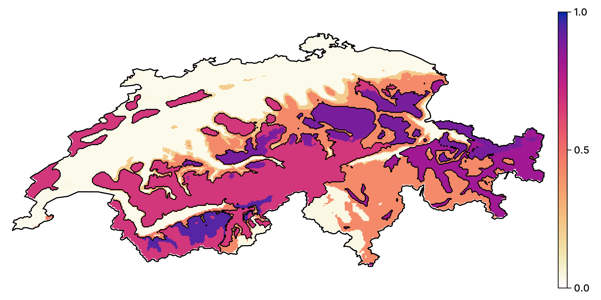\ 

## How is this model wrong?

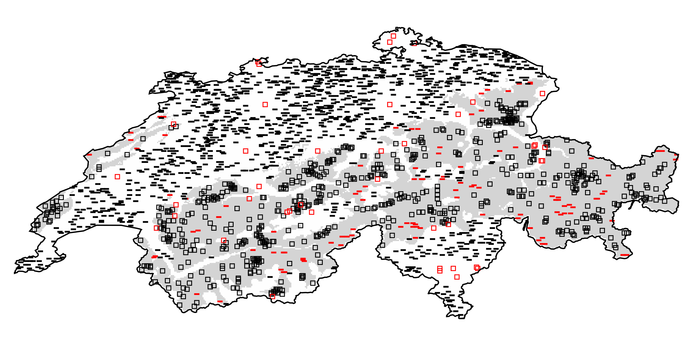\ 

## Can we improve on this model?

- \alert{variable selection}
- data transformation (we use PCA here, but there are many other)
- \alert{hyper-parameters tuning}

## A note on PCA

\ 

## Moving threshold classification

- $P(+) > P(-)$
- This is the same thing as $P(+) > 0.5$
- Is it, though?

## Learning curve for the threshold

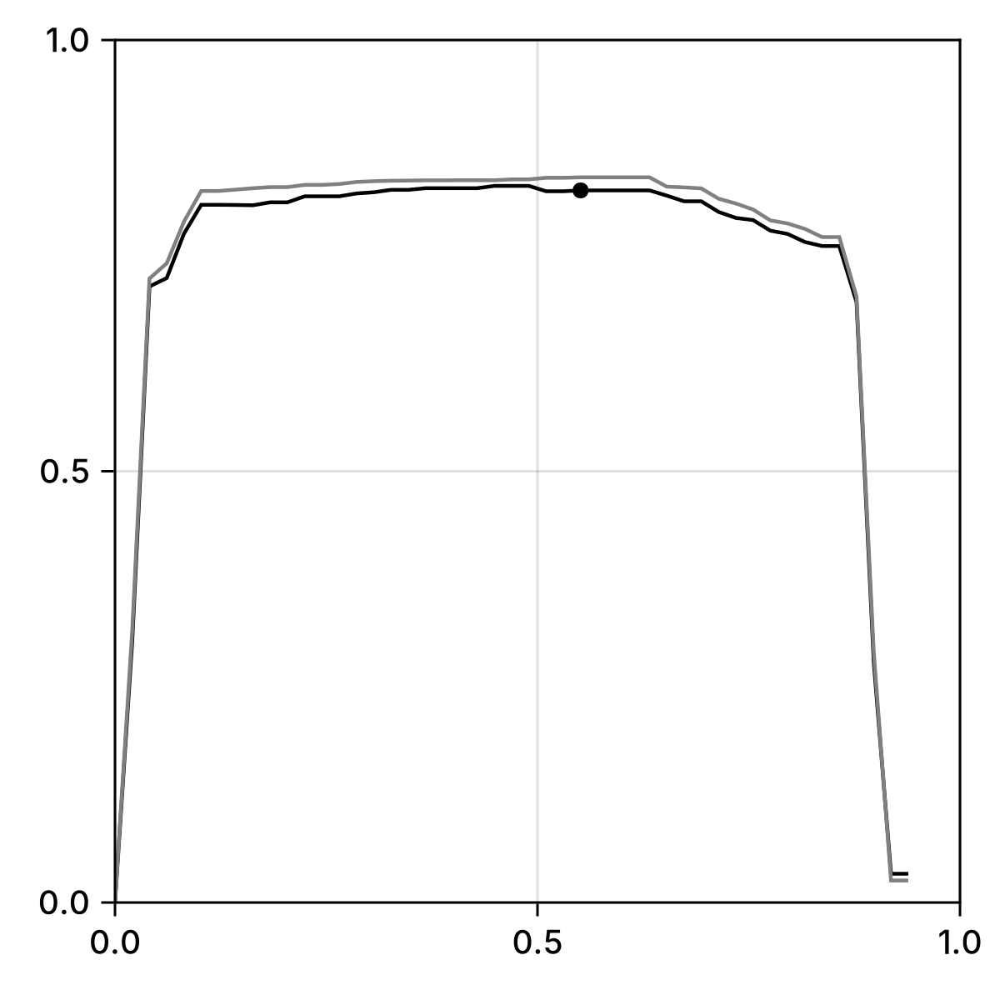\ 

## Receiver Operating Characteristic

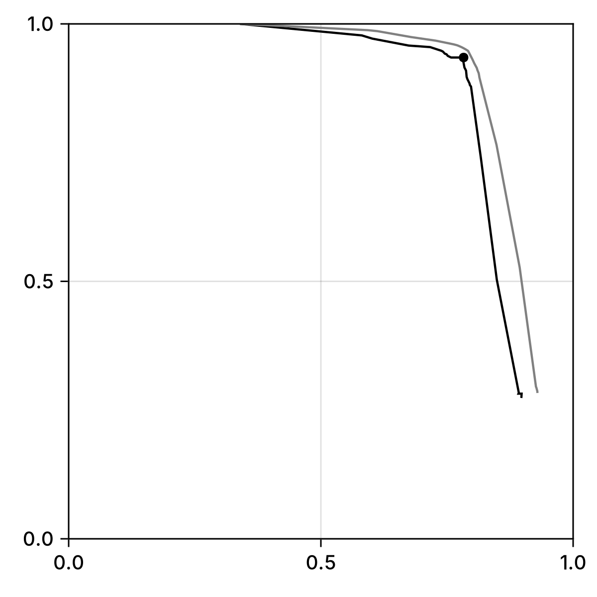\ 

## Precision-Recall Curve

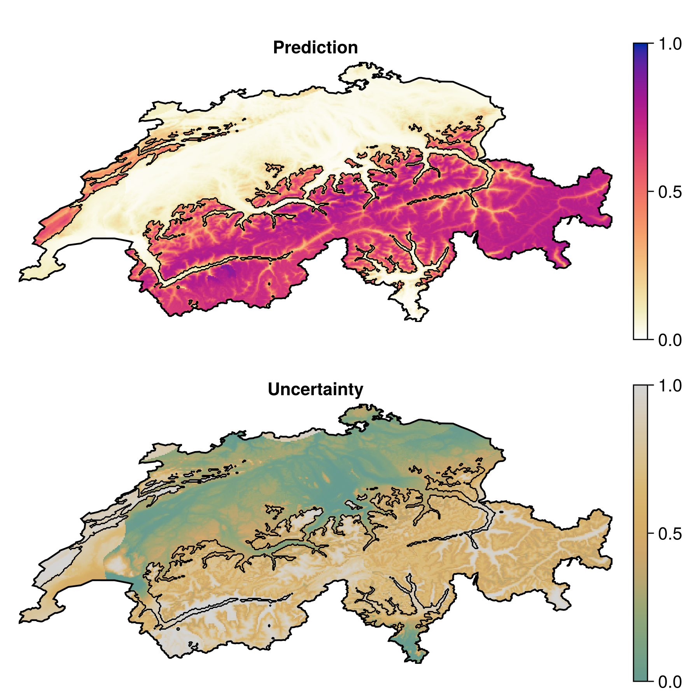\ 

## Revisiting the model performance

| **Model**         | **MCC** | **PPV** | **NPV** | **DOR** | **Accuracy** |
|------------------:|--------:|--------:|--------:|--------:|-------------:|
| No skill          | -0.00   |  0.34   |  0.66   |  1.00   |  0.55        |
| Dec. tree (val.)  |  0.80   |  0.83   |  0.96   | 210.06  |  0.91        |
| Dec. tree (tr.)   |  0.84   |  0.86   |  0.97   | 202.00  |  0.93        |
| Tuned tree (val.) |  0.83   |  0.85   |  0.96   | 198.33  |  0.92        |
| Tuned tree (tr.)  |  0.84   |  0.85   |  0.97   | 174.94  |  0.92        |

## Updated prediction

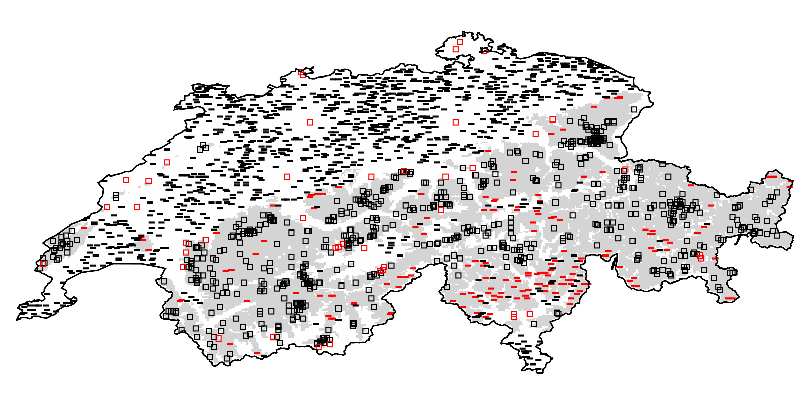\ 

## How is this model better?

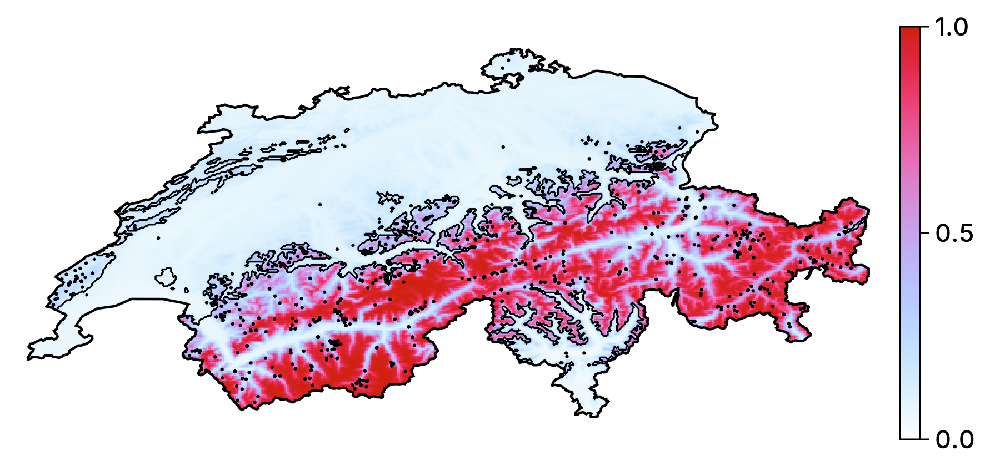\ 

## But wait!

Decision trees overfit: if we pick a maximum depth of 8 splits, how many nodes can we use?

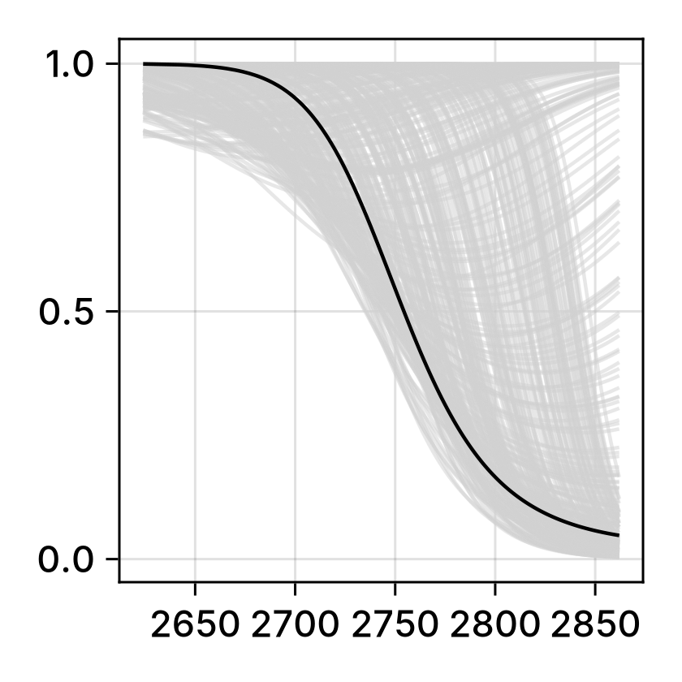\ 

# Ensemble models

## Limits of a single model

- it's a single model my dudes
- different subsets of the training data may have different signal
- do we need all the variables all the time?
- bias v. variance tradeoff
- fewer variables make it harder to overfit

## Bootstrapping and aggregation

- bootstrap the training \alert{instances} (32 samples for speed)
- randomly sample $\lceil \sqrt{n} \rceil$ variables

## Is this worth it?

Error: TaskFailedException

    nested task error: MethodError: no method matching predict(::Nothing, ::Vector{Float32})
    The function `predict` exists, but no method is defined for this combination of argument types.
    
    Closest candidates are:
      predict(!Matched::SDeMo.BIOCLIM, ::Vector{T}) where T<:Number
       @ SDeMo ~/.julia/packages/SDeMo/AuNGf/src/classifiers/bioclim.jl:19
      predict(!Matched::SDeMo.RawData, ::Any)
       @ SDeMo ~/.julia/packages/SDeMo/AuNGf/src/transformers/univariate.jl:10
      predict(!Matched::SDeMo.NaiveBayes, ::Vector{T}) where T<:Number
       @ SDeMo ~/.julia/packages/SDeMo/AuNGf/src/classifiers/naivebayes.jl:32
      ...
    
    Stacktrace:
      [1] predict(dn::SDeMo.DecisionNode, x::Vector{Float32}) (repeats 5 times)
        @ SDeMo ~/.julia/packages/SDeMo/AuNGf/src/classifiers/decisiontree.jl:210
      [2] predict
        @ ~/.julia/packages/SDeMo/AuNGf/src/classifiers/decisiontree.jl:202 [inlined]
      [3] #43
        @ ~/.julia/packages/SDeMo/AuNGf/src/classifiers/decisiontree.jl:218 [inlined]
      [4] _inner_mapslices!(R::Matrix{Float64}, indices::Base.Iterators.Drop{CartesianIndices{2, Tuple{Base.OneTo{Int64}, Base.OneTo{Int64}}}}, f::SDeMo.var"#43#44"{SDeMo.DecisionTree}, A::Matrix{Float32}, dim_mask::Tuple{Bool, Bool}, Aslice::Vector{Float32}, safe_for_reuse::Bool)
        @ Base ./abstractarray.jl:3338
      [5] mapslices(f::SDeMo.var"#43#44"{SDeMo.DecisionTree}, A::Matrix{Float32}; dims::Int64)
        @ Base ./abstractarray.jl:3326
      [6] predict(dt::SDeMo.DecisionTree, X::Matrix{Float32})
        @ SDeMo ~/.julia/packages/SDeMo/AuNGf/src/classifiers/decisiontree.jl:218
      [7] predict(sdm::SDeMo.SDM{Float32, Bool}, X::Matrix{Float32}; threshold::Bool)
        @ SDeMo ~/.julia/packages/SDeMo/AuNGf/src/pipeline.jl:52
      [8] predict
        @ ~/.julia/packages/SDeMo/AuNGf/src/pipeline.jl:50 [inlined]
      [9] (::SDeMo.var"#64#65"{@Kwargs{threshold::Bool}, Matrix{Float32}})(component::SDeMo.SDM{Float32, Bool})
        @ SDeMo ./none:0
     [10] iterate
        @ ./generator.jl:48 [inlined]
     [11] collect_to!(dest::Vector{Vector{Float64}}, itr::Base.Generator{Vector{SDeMo.SDM}, SDeMo.var"#64#65"{@Kwargs{threshold::Bool}, Matrix{Float32}}}, offs::Int64, st::Int64)
        @ Base ./array.jl:838
     [12] collect_to_with_first!(dest::Vector{Vector{Float64}}, v1::Vector{Float64}, itr::Base.Generator{Vector{SDeMo.SDM}, SDeMo.var"#64#65"{@Kwargs{threshold::Bool}, Matrix{Float32}}}, st::Int64)
        @ Base ./array.jl:816
     [13] collect(itr::Base.Generator{Vector{SDeMo.SDM}, SDeMo.var"#64#65"{@Kwargs{threshold::Bool}, Matrix{Float32}}})
        @ Base ./array.jl:790
     [14] predict(ensemble::SDeMo.Bagging, X::Matrix{Float32}; consensus::Function, kwargs::@Kwargs{threshold::Bool})
        @ SDeMo ~/.julia/packages/SDeMo/AuNGf/src/ensembles/pipeline.jl:46
     [15] macro expansion
        @ ~/.julia/packages/SDeMo/AuNGf/src/crossvalidation/crossvalidation.jl:169 [inlined]
     [16] (::SDeMo.var"#60#threadsfor_fun#106"{SDeMo.var"#60#threadsfor_fun#104#107"{@Kwargs{threshold::Bool}, SDeMo.Bagging, Vector{Any}, Vector{SDeMo.Bagging}, Vector{SDeMo.ConfusionMatrix}, Vector{SDeMo.ConfusionMatrix}, Base.OneTo{Int64}}})(tid::Int64; onethread::Bool)
        @ SDeMo ./threadingconstructs.jl:252
     [17] #60#threadsfor_fun
        @ ./threadingconstructs.jl:219 [inlined]
     [18] (::Base.Threads.var"#1#2"{SDeMo.var"#60#threadsfor_fun#106"{SDeMo.var"#60#threadsfor_fun#104#107"{@Kwargs{threshold::Bool}, SDeMo.Bagging, Vector{Any}, Vector{SDeMo.Bagging}, Vector{SDeMo.ConfusionMatrix}, Vector{SDeMo.ConfusionMatrix}, Base.OneTo{Int64}}}, Int64})()
        @ Base.Threads ./threadingconstructs.jl:154

Short answer: no

Long answer: maybe? Let's talk it through!

## Prediction of the rotation forest

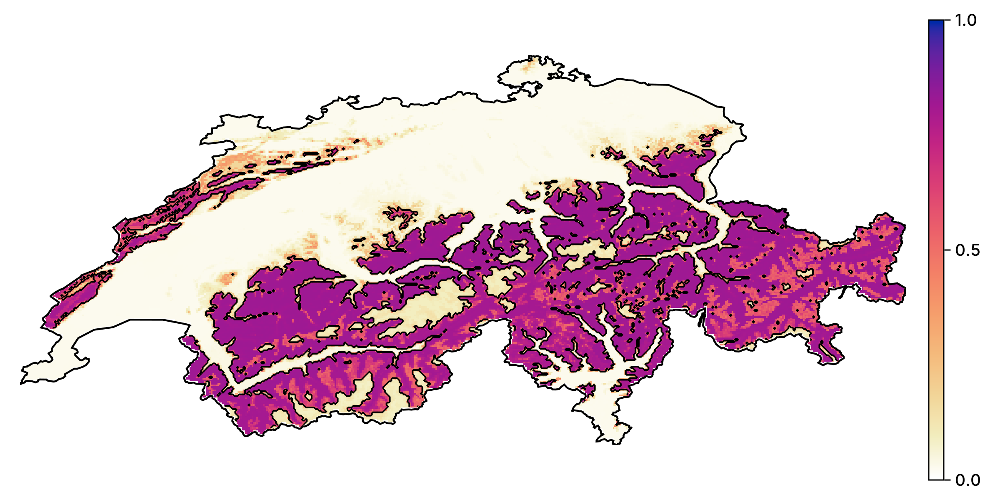\ 

## Prediction of the rotation forest

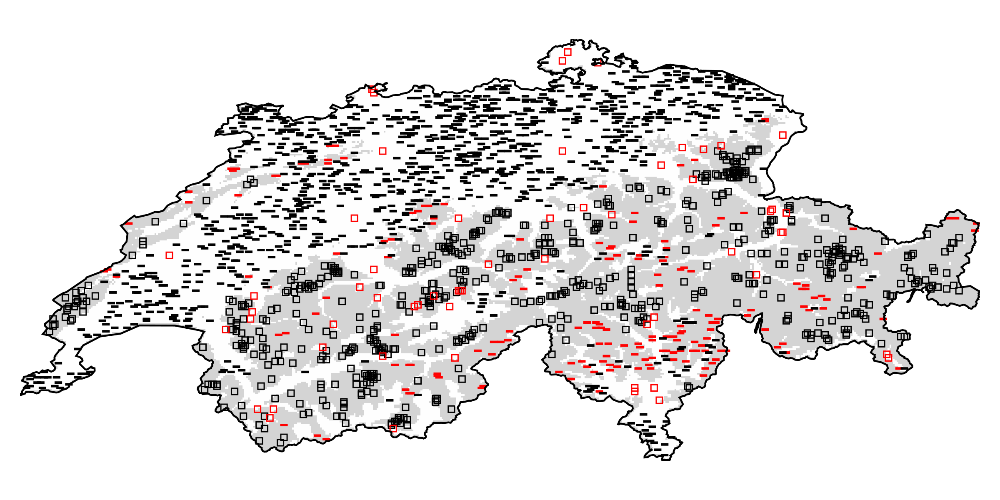\ 

## Variation between predictions

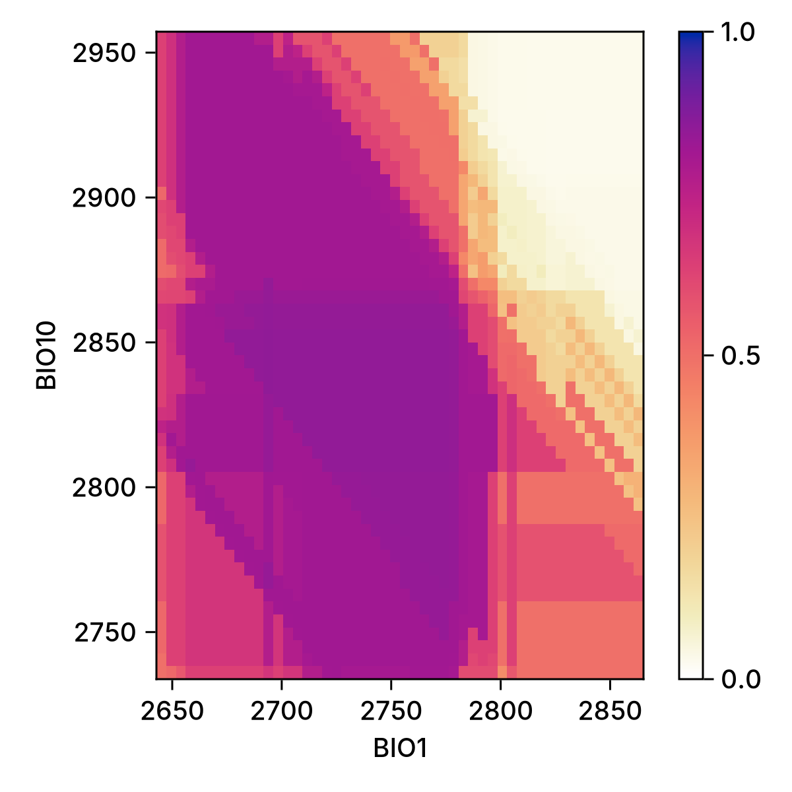\ 

## What, exactly, is bootstrap telling us?

- what if we had a little less data (it's conceptually close to cross-validation!)
- uncertainty about locations, not predictions

**Do we expect the model predictions to change at this location when we add more training data?**

## Variable importance

| **Layer** | **Variable**                      | **Import.** |
|----------:|----------------------------------:|------------:|
| 10        | BIO10                             | 0.28209     |
| 5         | BIO5                              | 0.253606    |
| 6         | BIO6                              | 0.1741      |
| 13        | BIO13                             | 0.0832986   |
| 15        | BIO15                             | 0.0797567   |
| 26        | Cultivated and Managed Vegetation | 0.0793417   |
| 12        | BIO12                             | 0.044542    |
| 29        | Snow/Ice                          | 0.0032655   |

# But why?

## Intro explainable

## Partial response curves

If we assume that all the variables except one take their average value, what is the prediction associated to the value that is unchanged?

Equivalent to a mean-field approximation

## Example with temperature

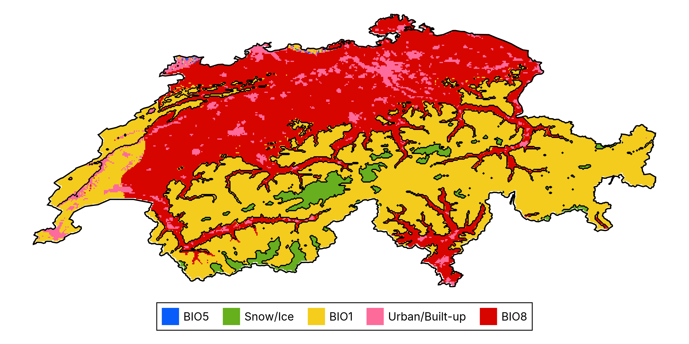\ 

## Example with two variables

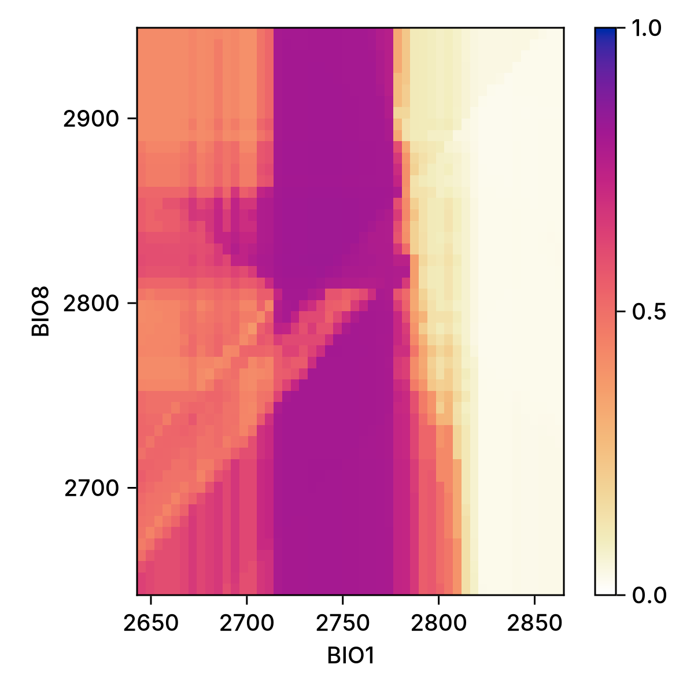\ 

## Spatialized partial response plot

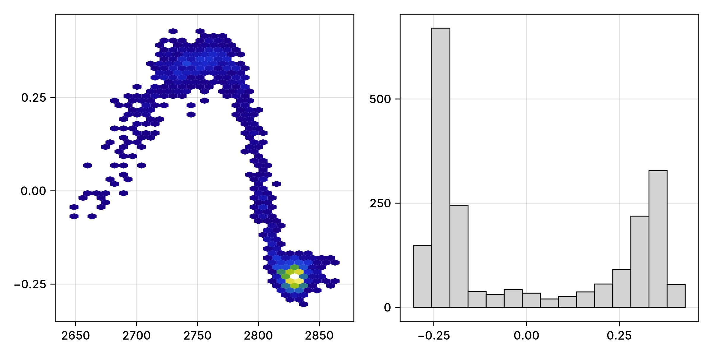\ 

## Spatialized partial response (binary outcome)

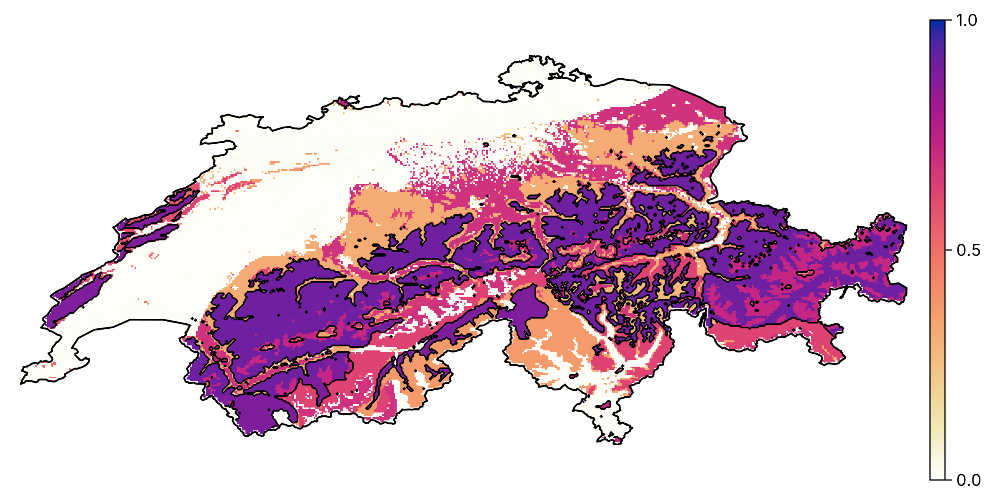\ 

## Inflated response curves

Averaging the variables is \alert{masking a lot of variability}!

Alternative solution:

1. Generate a grid for all the variables
2. For all combinations in this grid, use it as the stand-in for the variables to replace

In practice: Monte-Carlo on a reasonable number of samples.

## Example

\ 

## Limitations

- partial responses can only generate model-level information
- they break the structure of values for all predictors at the scale of a single observation
- their interpretation is unclear

## Shapley

- how much is the \alert{average prediction} modified by a specific variable having a specific value?
- it's based on game theory (but it's not *actually* game theory)
- many highly desirable properties!

## Response curves revisited

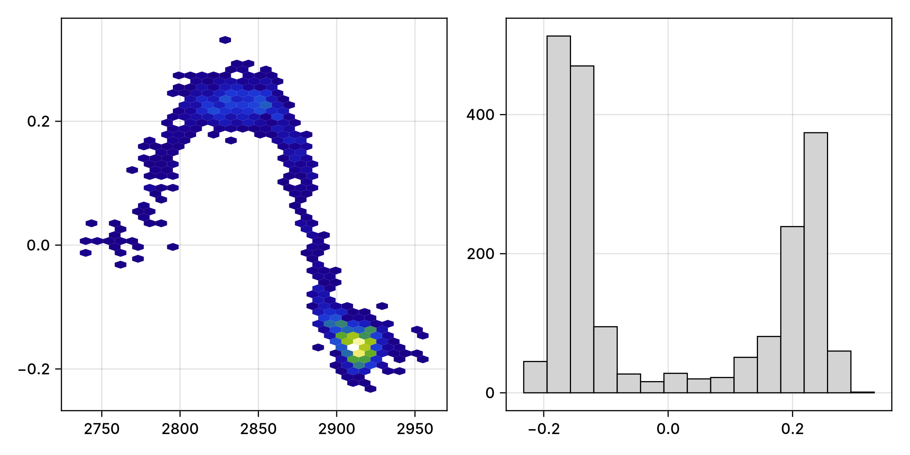\ 

## On a map

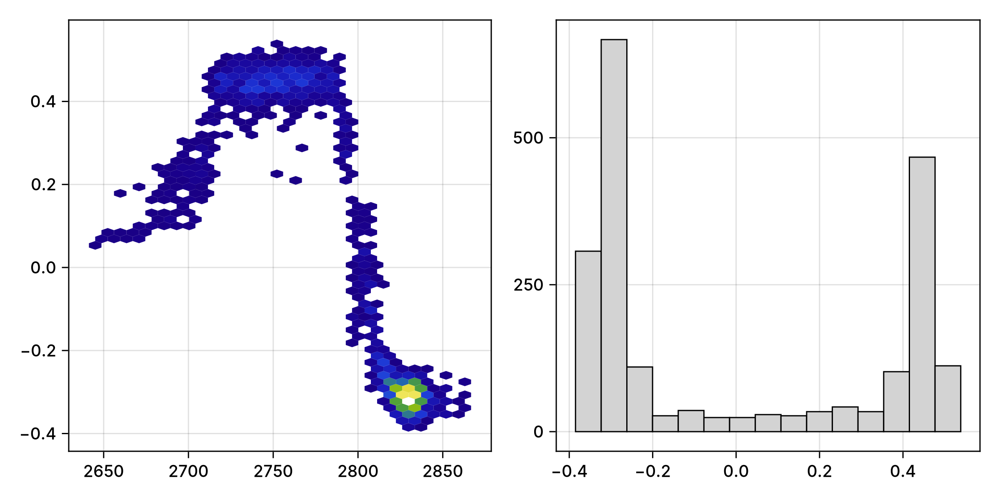\ 

## Variable importance revisited

| **Layer** | **Variable**                      | **Import.** | **Shap. imp.** |
|----------:|----------------------------------:|------------:|---------------:|
| 10        | BIO10                             | 0.28209     | 0.311491       |
| 5         | BIO5                              | 0.253606    | 0.253497       |
| 6         | BIO6                              | 0.1741      | 0.216219       |
| 26        | Cultivated and Managed Vegetation | 0.0793417   | 0.0629076      |
| 13        | BIO13                             | 0.0832986   | 0.0628641      |
| 12        | BIO12                             | 0.044542    | 0.0365544      |
| 15        | BIO15                             | 0.0797567   | 0.0303014      |
| 29        | Snow/Ice                          | 0.0032655   | 0.026165       |

## Most important predictor

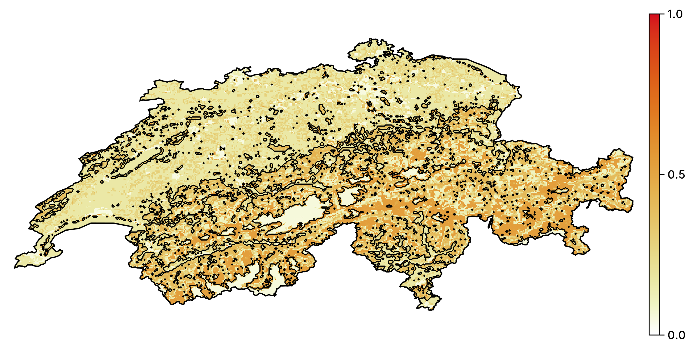\ 

# Summary

## SDMs are (applied) machine learning

- models we can train
- parameters can (should!) be tuned automatically
- we can use tools from explainable ML to give more clarity
