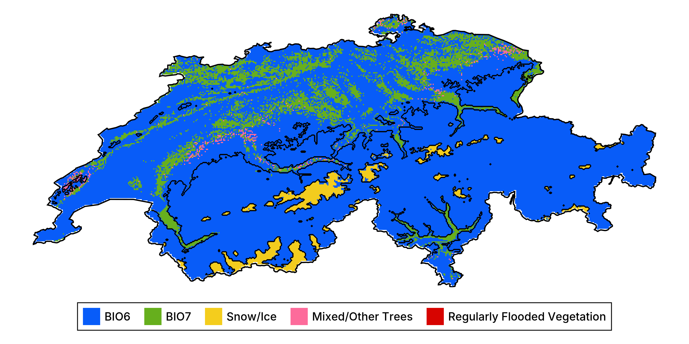

## Main goals

1. How do we produce a model?
2. How do we convey that it works?
3. How do we talk about how it makes predictions?
4. How do we use it to guide actions?

## The steps

1. Get data about species occurrences
2. Build a classifier and make it as good as we can
3. Measure its performance
4. Explain some predictions
5. Generate counterfactual explanations
6. Briefly discuss ensemble models

## But why...

... think of SDM as a ML problem?
: Because they are! We want to learn a predictive algorithm from data

... the focus on explainability?
: We cannot ask people to *trust* - we must *convince* and *explain*

# Problem statement

## The problem in ecological terms

We have information about a species

## The problem in other words

We have a series of observations $y \in \mathbb{B}$, and predictors variables
$\mathbf{X} \in \mathbb{R}$

We want to find an algorithm $f(\mathbf{x}) = \hat y$ that results in the
distance between $\hat y$ and $y$ being *small*

## Setting up the data for our example

The predictor data will come from CHELSA2 - we will start with the 19 BioClim
variables

We will use data on observations of *Turdus torquatus* in Switzerland,
downloaded from the copy of the eBird dataset on GBIF

## The observation data

\ 

## Problem!

We want $\hat y \in \mathbb{B}$, and so far we are missing \alert{negative
values}

## Solution!

pseudo-absences

what are the assumptions we make

## The (inflated) observation data

\ 

# Training the model

## The Naive Bayes Classifier

$$P(+|x) = \frac{P(+)}{P(x)}P(x|+)$$

$$\hat y = \text{argmax}_j \, P(\mathbf{c}_j)\prod_i P(\mathbf{x}_i|\mathbf{c}_j)$$

$$P(x|+) = \text{pdf}(x, \mathcal{N}(\mu_+, \sigma_+))$$

## Setup

## Cross-validation

Can we train the model

assumes parallel universes with slightly less data

is the model good?

## Null classifiers

coin flip

no skill

constant

## Expectations

| **Model**        | **MCC**      | **PPV**  | **NPV**  | **DOR**  | **Accuracy** |
|-----------------:|-------------:|---------:|---------:|---------:|-------------:|
| noskill          | -3.09497e-17 | 0.339373 | 0.660627 | 1.0      | 0.551602     |
| coinflip         | -0.321254    | 0.339373 | 0.339373 | 0.263902 | 0.339373     |
| constantpositive | 0.0          | 0.339373 | NaN      | NaN      | 0.339373     |
| constantnegative | 0.0          | NaN      | 0.660627 | NaN      | 0.660627     |

## Cross-validation strategy

k-fold

validation / training / testing

## Cross-validation results

| **Model**        | **MCC**      | **PPV**  | **NPV**  | **DOR**  | **Accuracy** |
|-----------------:|-------------:|---------:|---------:|---------:|-------------:|
| noskill          | -3.09497e-17 | 0.339373 | 0.660627 | 1.0      | 0.551602     |
| coinflip         | -0.321254    | 0.339373 | 0.339373 | 0.263902 | 0.339373     |
| constantpositive | 0.0          | 0.339373 | NaN      | NaN      | 0.339373     |
| constantnegative | 0.0          | NaN      | 0.660627 | NaN      | 0.660627     |
| Validation       | 0.384895     | 0.647967 | 0.768219 | 6.60144  | 0.736062     |
| Training         | 0.392684     | 0.652914 | 0.770902 | 6.33576  | 0.740233     |

## What to do if the model is trainable?

train it!

re-use the full dataset

## A note on data leakage

## Data transformation using PCA

## The model training pipeline

## Initial prediction

\ 

## How is this model wrong?

\ 

## Can we improve on this model?

variable selection

data transformation

hyper-parameters tuning

will focus on the later (same process for the two above)

## Moving theshold classification

p plus > p minus means threshold is 0.5

is it?

how do we check this

## Learning curve for the threshold

\ 

## Receiver Operating Characteristic

\ 

## Precision-Recall Curve

\ 

## Revisiting the model performance

| **Model**        | **MCC**      | **PPV**  | **NPV**  | **DOR**  | **Accuracy** |
|-----------------:|-------------:|---------:|---------:|---------:|-------------:|
| noskill          | -3.09497e-17 | 0.339373 | 0.660627 | 1.0      | 0.551602     |
| coinflip         | -0.321254    | 0.339373 | 0.339373 | 0.263902 | 0.339373     |
| constantpositive | 0.0          | 0.339373 | NaN      | NaN      | 0.339373     |
| constantnegative | 0.0          | NaN      | 0.660627 | NaN      | 0.660627     |
| Previous         | 0.384895     | 0.647967 | 0.768219 | 6.60144  | 0.736062     |
| Validation       | 0.744385     | 0.771569 | 0.947628 | 79.99    | 0.876604     |
| Training         | 0.73678      | 0.764253 | 0.947113 | 59.0436  | 0.873436     |

## Updated prediction

\ 

## How is this model better?

\ 

## Revisiting assumptions

- pseudo-absences
- not just a statistical exercise

## Variable importance

| **Layer** | **Variable**   | **Import.** |
|----------:|---------------:|------------:|
| 1         | BIO1           | 0.59825     |
| 5         | BIO5           | 0.233834    |
| 8         | BIO8           | 0.104139    |
| 28        | Urban/Built-up | 0.0412146   |
| 29        | Snow/Ice       | 0.0225633   |

# But why?

## Intro explainable

## An ecology tool: partial response curves

## Example with temperature

\ 

## Example with two variables

\ 

## Spatialized partial response plot

\ 

## Spatialized partial response (binary outcome)

\ 

## Inflated response curves

Averaging the variables is \alert{masking a lot of variability}!

Alternative solution:

1. Generate a grid for all the variables
2. For all combinations in this grid, use it as the stand-in for the variables to replace

In practice: Monte-Carlo on a reasonable number of samples.

## Example

\ 

## Limitations

- partial responses can only generate model-level information
- they break the structure of values for all predictors at the scale of a single observation
- their interpretation is unclear

## Shapley

## Example

## Response curves revisited

\ 

## On a map

\ 

## Variable importance revisited

| **Layer** | **Variable**   | **Import.** | **Shap. imp.** |
|----------:|---------------:|------------:|---------------:|
| 1         | BIO1           | 0.59825     | 0.415164       |
| 8         | BIO8           | 0.104139    | 0.261453       |
| 5         | BIO5           | 0.233834    | 0.137676       |
| 28        | Urban/Built-up | 0.0412146   | 0.125304       |
| 29        | Snow/Ice       | 0.0225633   | 0.0604023      |

## Most important predictor

\ 

## Revisiting the data transformation

all in a single model so we can ask effect of variable instead of effect of PC1 or whatever

# What if?

## Intro to counterfactuals

what they are

## Setting up a new problem

- land use
- decision tree - very easy to overfit
- at most 18 nodes of depth at most 7
- same process

## Variable importance

| **Layer** | **Variable**   | **Relative importance** |
|----------:|---------------:|------------------------:|
| 1         | BIO1           | 0.637614                |
| 5         | BIO5           | 0.248376                |
| 8         | BIO8           | 0.0824429               |
| 28        | Urban/Built-up | 0.0190532               |
| 29        | Snow/Ice       | 0.0125144               |

## Visualizing the prediction

\ 

## The Rashomon effect

- different but equally likely alternatives
- happens at all steps in the process
- variable selected, threshold used, model type

## Visualizing the errors

\ 

## Partial response (Shapley)

\ 

## Generating a counterfactual

## Evaluating the counterfactuals

## What is a good counterfactual

learning rate and loss function

use on prediction score and not yes/no!

## Algorithmic recourse

# Ensemble models

## Limits of a single model

- a single model
- different parts of data may have different signal
- do we need all the variables all the time?
- bias v. variance tradeoff
- limit overfitting

## Bootstrapping and aggregation

## An example of bagging: rotation forest

## Prediction of the rotation forest

\ 

## Prediction of the rotation forest

\ 

## Uncertainty

\ 

## Heterogeneous ensembles

## Setting up an heterogeneous ensemble

# Conclusions
