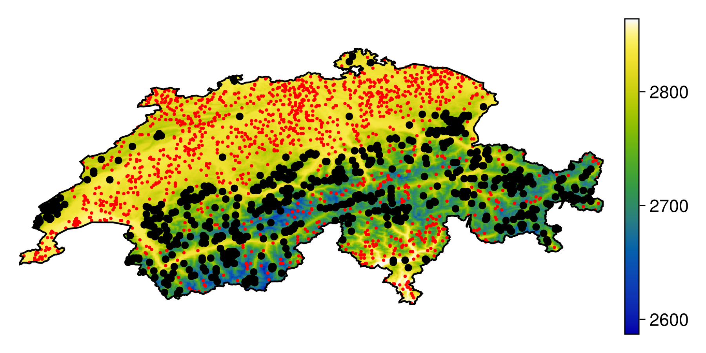
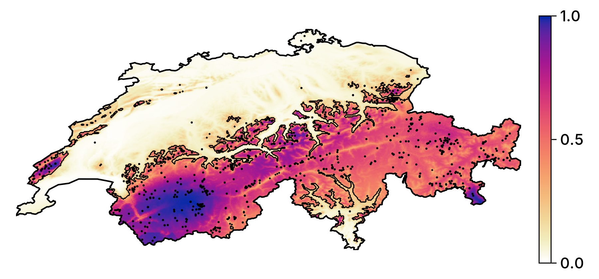

## Main goals

1. How do we produce a model?
2. How do we convey that it works?
3. How do we talk about how it makes predictions?
4. How do we use it to guide actions?

## The steps

1. Get data about species occurrences
2. Build a classifier and make it as good as we can
3. Measure its performance
4. Explain some predictions
5. Generate counterfactual explanations
6. Briefly discuss ensemble models

## But why...

... think of SDM as a ML problem?
: Because they are (and would be better if we accepted this)

... the focus on explainability?
: We cannot ask people to *trust* - we must *convince*

# Introduction

## Getting data

## Getting a polygon

## CHELSA2 data

## Trimming polygon

## Download data from GBIF

# Validation

## Pseudo-absences

~~~~
SDM Layer with 45336 Bool cells
	Proj string: +proj=longlat +datum=WGS84 +no_defs
	Grid size: (239, 543)
~~~~

## Visu

\ 

# Model setup

## Setup

~~~~
SDeMo.MultivariateTransform{MultivariateStats.PCA} → SDeMo.NaiveBayes → P(x
) ≥ 0.5
~~~~

## Cross-validation

~~~~
0.5620979518435002
~~~~

## re-training

~~~~
SDeMo.MultivariateTransform{MultivariateStats.PCA} → SDeMo.NaiveBayes → P(x
) ≥ 0.281
~~~~

## Initial pred

~~~~
SDM Layer with 69967 Float64 cells
	Proj string: +proj=longlat +datum=WGS84 +no_defs
	Grid size: (239, 543)
~~~~

## Visu

\ 

# Why?

## code

## Visu

\ 

## mosaic

~~~~
SDM Layer with 69967 Int64 cells
	Proj string: +proj=longlat +datum=WGS84 +no_defs
	Grid size: (239, 543)
~~~~

## visu

\ 

# About ensemble models 

## Uncertainty

~~~~
0.6537641876644507
~~~~

## Add pred

~~~~
SDM Layer with 69967 Float64 cells
	Proj string: +proj=longlat +datum=WGS84 +no_defs
	Grid size: (239, 543)
~~~~

## Visu 2

\ 

