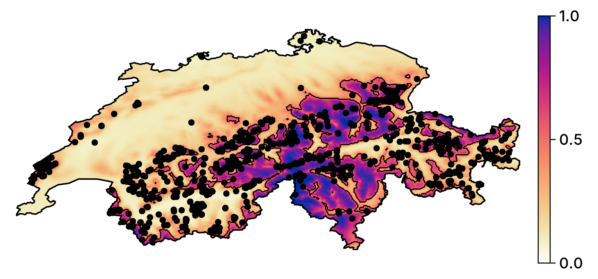

## Main goals

1. How do we produce a model?
2. How do we convey that it works?
3. How do we talk about how it makes predictions?
4. How do we use it to guide actions?

## The steps

1. Get data about species occurrences
2. Build a classifier and make it as good as we can
3. Measure its performance
4. Explain some predictions
5. Generate counterfactual explanations
6. Briefly discuss ensemble models

## But why...

... think of SDM as a ML problem?
: Because they are! We want to learn a predictive algorithm from data

... the focus on explainability?
: We cannot ask people to *trust* - we must *convince* and *explain*

# Problem statement

## The problem in ecological terms

We have information about a species

## The problem in other words

We have a series of observations $y \in \mathbb{B}$, and predictors variables $\mathbf{X} \in \mathbb{R}$

We want to find an algorithm $f(\mathbf{x}) = \hat y$ that results in the distance between $\hat y$ and $y$ being *small*

## Setting up the data for our example

The predictor data will come from CHELSA2 - we will start with the 19 BioClim variables

We will use data on observations of *Turdus torquatus* in Switzerland, downloaded from the copy of the eBird dataset on GBIF

## The observation data

\ 

## Problem!

We want $\hat y \in \mathbb{B}$, and so far we are missing \alert{negative values}

## Solution!

pseudo-absences

what are the assumptions we make

~~~~
SDM Layer with 45336 Bool cells
	Proj string: +proj=longlat +datum=WGS84 +no_defs
	Grid size: (239, 543)
~~~~

## The (inflated) observation data

\ 

# Training the model

## The Naive Bayes Classifier

$$P(+|x) = \frac{P(+)}{P(x)}P(x|+)$$

$$\hat y = \text{argmax}_j \, P(\mathbf{c}_j)\prod_i P(\mathbf{x}_i|\mathbf{c}_j)$$

$$P(x|+) = \text{pdf}(x, \mathcal{N}(\mu_+, \sigma_+))$$

## Setup

~~~~
SDeMo.MultivariateTransform{MultivariateStats.PCA} → SDeMo.NaiveBayes → P(x
) ≥ 0.5
~~~~

## Cross-validation

Can we train the model

assumes parallel universes with slightly less data

is the model good?

## Cross-validation strategy

k-fold

validation / training / testing

~~~~
0.33164125784542653
~~~~

## What to do if the model is trainable?

train it!

re-use the full dataset

~~~~
SDM Layer with 69967 Bool cells
	Proj string: +proj=longlat +datum=WGS84 +no_defs
	Grid size: (239, 543)
~~~~

## Initial prediction

\ 

## Can we improve on this model?

variable selection

data transformation

hyper-parameters tuning

will focus on the later (same process for the two above)

## Moving theshold classification

p plus > p minus means threshold is 0.5

is it?

how do we check this

## Optimizing the threshold

