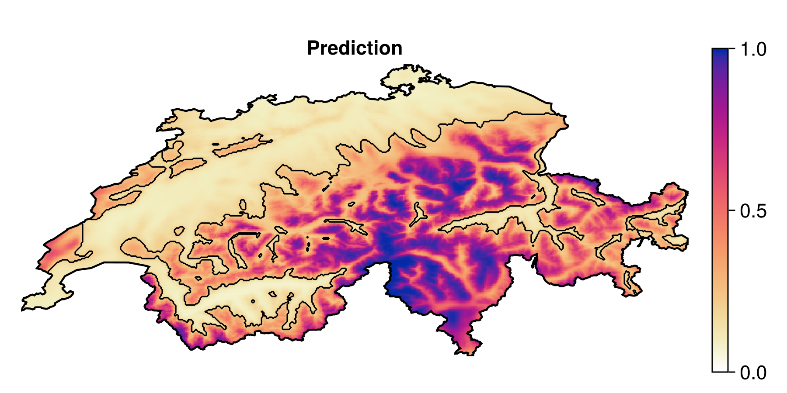
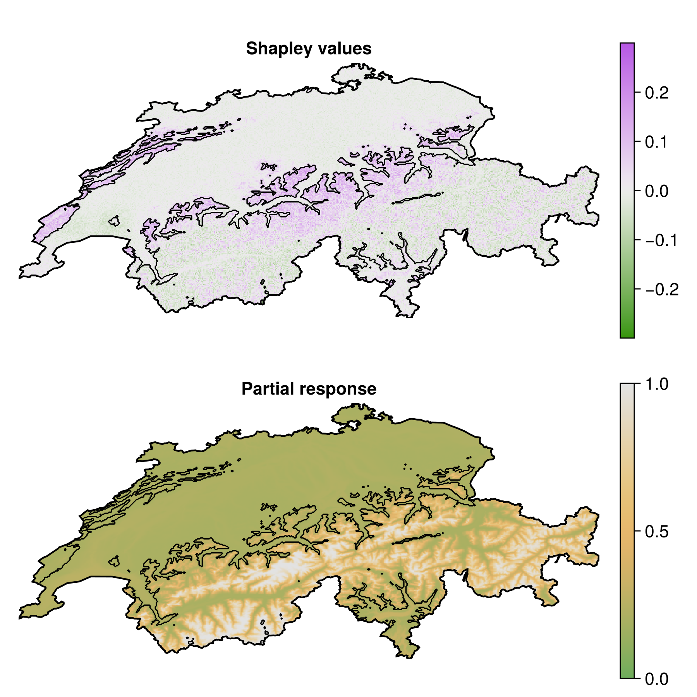

## Main goals

1. How do we produce a model?
2. How do we convey that it works?
3. How do we talk about how it makes predictions?
4. How do we use it to guide actions?

## The steps

1. Get data about species occurrences
2. Build a classifier and make it as good as we can
3. Measure its performance
4. Explain some predictions
5. Generate counterfactual explanations
6. Briefly discuss ensemble models

## But why...

... think of SDM as a ML problem?
: Because they are! We want to learn a predictive algorithm from data

... the focus on explainability?
: We cannot ask people to *trust* - we must *convince* and *explain*

# Problem statement

## The problem in ecological terms

We have information about a species

## The problem in other words

We have a series of observations $y \in \mathbb{B}$, and predictors variables $\mathbf{X} \in \mathbb{R}$

We want to find an algorithm $f(\mathbf{x}) = \hat y$ that results in the distance between $\hat y$ and $y$ being *small*

## Setting up the data for our example

The predictor data will come from CHELSA2 - we will start with the 19 BioClim variables

We will use data on observations of *Turdus torquatus* in Switzerland, downloaded from the copy of the eBird dataset on GBIF

## The observation data

{height=\textheight}\ 

## Problem!

We want $\hat y \in \mathbb{B}$, and so far we are missing \alert{negative values}

## Solution!

pseudo-absences

what are the assumptions we make

## The (inflated) observation data

{height=\textheight}\ 

# Training the model

## The Naive Bayes Classifier

$$P(+|x) = \frac{P(+)}{P(x)}P(x|+)$$

$$\hat y = \text{argmax}_j \, P(\mathbf{c}_j)\prod_i P(\mathbf{x}_i|\mathbf{c}_j)$$

$$P(x|+) = \text{pdf}(x, \mathcal{N}(\mu_+, \sigma_+))$$

## Setup

## Cross-validation

Can we train the model

assumes parallel universes with slightly less data

is the model good?

## Null classifiers

coin flip

no skill

constant

## Expectations

| **Model**        | **MCC**      | **PPV**  | **NPV**  | **DOR** | **Accuracy** |
|-----------------:|-------------:|---------:|---------:|--------:|-------------:|
| noskill          | -3.10619e-17 | 0.336873 | 0.663127 | 1.0     | 0.553221     |
| coinflip         | -0.326255    | 0.336873 | 0.336873 | 0.25807 | 0.336873     |
| constantpositive | 0.0          | 0.336873 | NaN      | NaN     | 0.336873     |
| constantnegative | 0.0          | NaN      | 0.663127 | NaN     | 0.663127     |

## Cross-validation strategy

k-fold

validation / training / testing

## What to do if the model is trainable?

train it!

re-use the full dataset

## Initial prediction

{height=\textheight}\ 

## Can we improve on this model?

variable selection

data transformation

hyper-parameters tuning

will focus on the later (same process for the two above)

## Moving theshold classification

p plus > p minus means threshold is 0.5

is it?

how do we check this

## Learning curve for the threshold

{height=\textheight}\ 

## Receiver Operating Characteristic

{height=\textheight}\ 

## Precision-Recall Curve

{height=\textheight}\ 

## Revisting the model performance

## Updated prediction

{height=\textheight}\ 

## Variable importance

# But why?

## Intro explainable

## An ecology tool: partial response curves

## Example with temperature

{height=\textheight}\ 

## Example with two variables

{height=\textheight}\ 

## Spatialized partial response plot

{height=\textheight}\ 

## Spatialized partial response (binary outcome)

{height=\textheight}\ 

## Inflated response curves

Averaging the variables is \alert{masking a lot of variability}!

Alternative solution:

1. Generate a grid for all the variables
2. For all combinations in this grid, use it as the stand-in for the variables to replace

In practice: Monte-Carlo on a reasonable number of samples.

## Example

{height=\textheight}\ 

## Limitations

- partial responses can only generate model-level information
- they break the structure of values for all predictors at the scale of a single observation
- their interpretation is unclear

## Shapley

## Example

## Response curves revisited

{height=\textheight}\ 

## On a map

{height=\textheight}\ 

## Variable importance revisited

with shapley

## Most important predictor

mosaic map

# What if?

## Intro to counterfactuals

what they are

# Ensemble models

# Conclusions